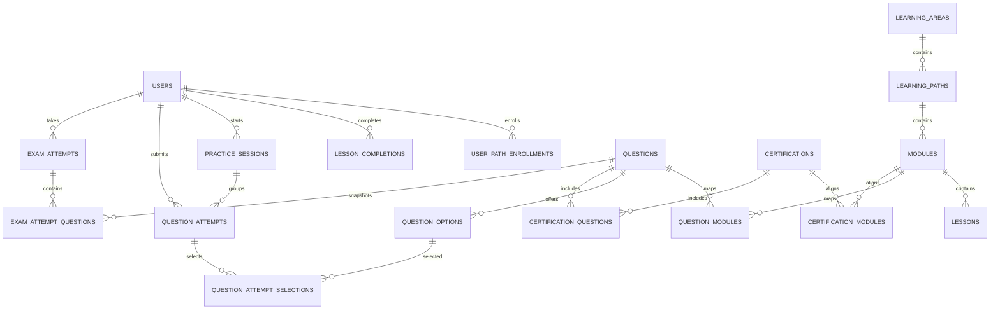

# SkillPath 数据库设计

## 1. 目标

SkillPath 的数据库需要同时支持：

- 用户注册、登录与个人设置
- Learning Area → Learning Path → Module → Lesson 的课程结构
- Azure、AWS 以及未来其他领域的题库
- 课程与认证之间的可选映射
- 课程完成、练习记录、错题与薄弱项
- 模拟考试与答题回顾

当前实现采用 **Entity Framework Core + SQLite** 作为本地数据库，不要求安装 Docker 或数据库服务器。生产目标仍建议使用 **SQL Server / Azure SQL**；领域模型保持一致，但需要生成 SQL Server provider 对应的 migration。旧 `skillpath.json` 只在首次启动时作为迁移来源，之后数据库成为正式数据源。

## 2. 核心原则

1. **课程优先**：先设计 Learning Path、Module、Lesson，再将题目映射到课程模块。
2. **认证是附加层**：认证、模块、题目通过映射表关联，不作为课程结构的主键。
3. **进度按事件保存**：保存每次课程完成和答题尝试，不直接保存 `18% Overall`；百分比、薄弱项和 streak 从事实数据计算。
4. **正确答案只留在后端**：题目接口不返回 `QuestionOptions.IsCorrect`，提交答案后由 API 判分。
5. **稳定标识**：数据库使用全局 `bigint` ID；`Slug` 用于 URL；`SourceKey` 用于导入旧题库。

## 3. 数据关系

## 4. 表职责

### 内容与课程

| 表 | 职责 |
|---|---|
| `LearningAreas` | 顶层领域，例如 Cloud；未开放领域只需设置状态，无需伪造具体课程 |
| `LearningPaths` | 一个领域下的学习路径，例如 Cloud Engineer Path |
| `Modules` | 有教学顺序的课程模块，不由题库 tag 自动生成 |
| `Lessons` | 真正的学习内容，内容暂用 Markdown 保存 |
| `Questions` | 题干、题型、解释和交互配置，不直接绑定某个认证 |
| `QuestionOptions` | 选项和正确答案；正确性仅由后端使用 |
| `QuestionModules` | 将题目映射到课程模块，可指定一个 primary module |

### 认证附加层

| 表 | 职责 |
|---|---|
| `Certifications` | AZ-900、CLF-C02 等认证元数据 |
| `CertificationModules` | 认证覆盖哪些课程模块及其权重 |
| `CertificationQuestions` | 认证题库与题目之间的映射 |

### 用户与进度

| 表 | 职责 |
|---|---|
| `Users` | 账号、密码哈希和账户状态 |
| `UserPreferences` | 用户设置，一名用户一行 |
| `UserPathEnrollments` | 用户当前学习路径及 Continue Learning 位置 |
| `LessonCompletions` | 课程完成事实；用户与课程联合唯一 |
| `PracticeSessions` | Quick Practice、Weak Areas、Mistakes 等练习会话 |
| `QuestionAttempts` | 每一次答题尝试和判分结果 |
| `QuestionAttemptSelections` | 一次尝试选择了哪些选项 |
| `ExamAttempts` | 一次模拟考试的总状态和成绩 |
| `ExamAttemptQuestions` | 固定本次考试题目和顺序，避免题库更新影响历史回顾 |

## 5. 关键设计决定

### 题目 ID 冲突

现有 Azure 和 AWS 文件都使用独立的数字 ID，直接合并后会产生相同 `questionId`。迁移时：

- 新 `Questions.Id` 由数据库全局生成。
- `Questions.SourceKey` 使用 `{certification}:{legacyId}`，例如 `AZ-900:42`。
- 前端进度改用新的全局 ID，不能继续只保存旧数字 ID。

### 学习进度

以下数据不单独作为真值保存：

- Overall progress
- Module progress
- Knowledge checks completed
- Weak areas
- Learning streak

它们应从 `LessonCompletions` 和 `QuestionAttempts` 计算。流量增加后可以建立缓存或每日汇总表，但原始事件仍是真值。

### 删除策略

课程、题目和认证默认使用 `Status = archived` 软下线，不物理删除。这样历史答题与考试回顾不会因为内容下线而失去引用。

### 时间

数据库统一保存 UTC `datetimeoffset`。学习 streak 根据用户时区在 API 层换算自然日。

## 6. API 与表的对应关系

| API | 主要数据表 |
|---|---|
| `POST /api/auth/register` | `Users`, `UserPreferences` |
| `GET /api/learning-areas` | `LearningAreas`, `LearningPaths` |
| `GET /api/paths/{slug}` | `LearningPaths`, `Modules`, `Lessons` |
| `GET /api/me/learning` | `UserPathEnrollments`, `LessonCompletions`, `QuestionAttempts` |
| `PUT /api/lessons/{id}/completion` | `LessonCompletions`, `UserPathEnrollments` |
| `POST /api/practice-sessions` | `PracticeSessions` |
| `GET /api/practice-sessions/{id}/next` | `Questions`, `QuestionOptions`（不返回 `IsCorrect`） |
| `POST /api/questions/{id}/attempts` | `QuestionAttempts`, `QuestionAttemptSelections` |
| `POST /api/exam-attempts` | `ExamAttempts`, `ExamAttemptQuestions` |
| `POST /api/exam-attempts/{id}/finish` | `ExamAttempts`, `QuestionAttempts` |

## 7. 分阶段迁移

### Phase 1：替换 JSON 进度

1. 引入 EF Core 与 SQL Server。
2. 迁移 `Users`。
3. 迁移课程、题库和选项。
4. 将 JSON 中的 `completedLessons` 迁移到 `LessonCompletions`。
5. 将 JSON 中的 `results` 迁移到 `QuestionAttempts`。
6. 保持现有前端 API 可用，后端内部改为数据库读写。

### Phase 2：后端题库与判分

1. 前端删除完整题库和正确答案。
2. 练习开始时由后端生成固定 session。
3. 提交答案后由后端判分并返回 explanation。
4. 模拟考试使用 `ExamAttemptQuestions` 固定题目顺序。

### Phase 3：管理内容

1. 增加内容管理 API。
2. 支持草稿、发布、归档和内容版本。
3. 增加统计查询和学习进度缓存。

## 8. 文件

SQL Server 建表脚本位于 [`database/schema.sql`](database/schema.sql)。它只建立结构和索引，不修改当前 JSON 数据，也不会影响正在运行的前后端。
